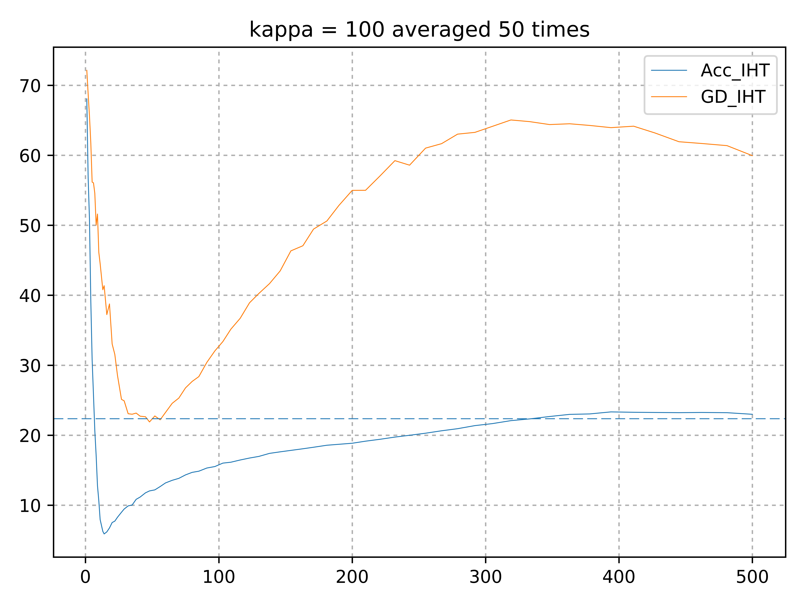

(In Progress)We study the problem of Sparse Regression, a landmark problem in the domain of Machine Learning, Statistics and Optimization which finds numerous applications in Compressed Sensing, model compression, high dimensional statistics, bio-informatics, [resource constrained machine learning](https://www.microsoft.com/en-us/research/project/resource-efficient-ml-for-the-edge-and-endpoint-iot-devices/) and more. Sparse Regression can be written down as an optimization problem as

$$
\xbar = \argmin\limits_{\lznorm{\x}\leq \sstar} f(\x)
$$

where $$\x\in\Rd{d}$$, $$s^* \leq d$$, the ambient dimension, $$\lznorm{\cdot}$$ is the $$\ell_0$$ norm that denotes the number of non-zero elements of its arguments, and $$f$$ is a real valued function.

Our focus has been on the linear version of the problem where given $$n$$ samples of $$d$$ dimensional data $$\A\in\Rd{n\times d}$$ and a response vector $$\y\in\Rd{d}$$, we want to recover a $$\sstar$$-sparse vector $$\xbar$$ that minimizes the squared loss function $$\esqnorm{\A\x-\y}$$. However, this problem can be shown to be NP-hard via a [reduction to 3-set cover](https://pdfs.semanticscholar.org/f629/5fd69d76d606f66cc15f58767a8161d60335.pdf), nonetheless this problem has been studied under a variety of assumptions such as the ones below
1. **Mutual Incoherence** - Implies that the $$\abs{\inner{\A_i,\A_j}}$$ should be bounded by some small positive real number $$M$$ for all $$i\neq j$$. In specific it can be shown OMP (which we will discuss in detail below) can recover $$\xbar$$ in exactly $$\sstar$$ steps if $$M\leq \inv{2\sstar-1}$$. Refer [Theorem 5.14, Foucart and Rauhut](http://www.cis.pku.edu.cn/faculty/vision/zlin/A%20Mathematical%20Introduction%20to%20Compressive%20Sensing.pdf) for a short proof.
Note that this can be equivalently written as
\$$
\infnorm{vec(\A^T\A - \I_{d})} \leq M.
$$
2. **Restricted Isometry Property (RIP)** - Instead of enforcing an element-wise restcriction on the off-diagonals of the matrix $$\A^T\A$$, RIP (at a level $$s$$) requries a more general assumption that all $$s$$-sized principal block sub-matrices of $$\A^T\A$$ are $$\delta_s$$ close to $$\I_s$$ in the operator norm, i.e., $$ \enorm{\A_\Sset^T\A_\Sset-\I_s} \leq \delta_s$$.
Note that this also implies the below inequality

$$
(1-\delta_s)\esqnorm{\vvec} \leq \esqnorm{\A\vvec} \leq (1+\delta_s)\esqnorm{\vvec} \ \forall\ \vvec \in\Rd{d} \text{ s.t. } \lznorm{\vvec} \leq s.
$$

It can be easily shown that Mutual Incoherence $$\implies$$ RIP via $$\roundbrack{\delta_s\leq M(s-1) \ \forall\ s\geq 2}$$. Refer [Lemma A.1, Donoho, Elad, Temlyakov](http://citeseerx.ist.psu.edu/viewdoc/download?doi=10.1.1.84.7896&rep=rep1&type=pdf) for a short proof.
3. **Restricted Null space property** - Implies that all the vectors in the null space of $$\A$$ (except $$\zero$$) are far from being sparse. This property essentially characterizes when $$\ell_1$$ based sparse recovery algorithms work. Formally it requires
\$$
\curlybrack{\vvec\in\Rd{d} \mid \A\vvec = \zero}\cap\curlybrack{\vvec \in \Rd{d} \mid \norm{1}{\vvec_{\Sset^\mathsf{c}}} \leq \norm{1}{\vvec_\Sset}} = \zero.
$$
Restricted Null Space property an even weaker assumption than RIP
4. **Restricted Strong Convexity (RSC)** - This is a generalization of RIP as in the contraction that $$\A$$ as an operator can perform on any $$s$$-sparse vector $$\vvec$$ can be arbitrariliy small (but not $$0$$). It essentiall means that there is a significant difference (in the $$\ell_2$$ norm sense) in the responses of 2 candidate sparse vectors which differ in their support by at most $$s$$. Formally,

$$
\esqnorm{\A\x-\A\z} \geq \rsc{s}\esqnorm{\x-\z}\quad \forall\ \x,\z\in\Rd{d} \text{ s.t. } \lznorm{\x-\z} \leq s
$$

where $$\rsc{s}$$ is the RSC constant at the level $$s$$. RSC is the weakest and the most popular asumption of all mentioned for sparse regression problems studied in the context of various algorithms.

Mutual Incoherence $$\implies$$ RIP $$\implies$$ Restricted Null Space Property $$\implies$$ RSC.
{: style="text-align: center"}

The Linear form of Sparse Linear Regression $$\roundbrack{\slr}$$ is a representative problem and results typically extend easily to the general case. We cosider the statistical setting of $$\slr$$ where the response is corrupted by adding a i.i.d. gaussian noise vector. We attempt to study this problem under the RSC assumption for a greedy algorithm Orthogonal Matching Pursuit algorithm.

$$
\y = \A\xbar + \etavec = \A_{\Sstar}\xbar_{\Sstar} + \etavec
$$

where $$\etavec\sim \mathcal{N}\roundbrack{\zero,\sigma^2 \I_n}$$ has i.i.d. normally distributed elements with variance $$\sigma^2$$, and $$\text{supp}(\xbar) = \sstar$$.

# Questions to ask
1. For any sparse regression algorithm, bounding the generalization error under a statistical model is a major machine learning goal. Here, the generalization error is defined as
$$
G(\x) = \inv{n}\esqnorm{\A\x-\y}
$$
where the rows of $$\A$$ are i.i.d. samples from some data distribution.
2. Bounding the generalizataion error alone does not guarentee that the algorithm revovers the true support. This can be loosely answered by arguing if the algorithm can output a support set $$\Sset$$ such that $$\Sset \supseteq \Sstar$$. Ideally one would like to have the smallest such set $$\Sset$$ satisfying the superset condition.

It is to note that given support recovery, smaller the support set size, lower is generaliztaion error. Recovering the true support is a fundamentally harder problem as strong support recovery results usually tend to provide strong generalization error bounds.

## Algorithms for $$\slr$$
Broadly, existing sparse regresison algorithms can be broadly categorized into 3 categories.
1. $$\ell_1$$ minimization or LASSO based algorithms. E.g. - [Dantzig selector](https://arxiv.org/pdf/math/0506081.pdf) etc.
2. Non-convex penalty based. E.g. - [Iterative Hard Thresholding](https://papers.nips.cc/paper/5293-on-iterative-hard-thresholding-methods-for-high-dimensional-m-estimation.pdf), [Penalty based methods like SCAD penalty, Log-sum penalty](https://arxiv.org/abs/1412.5632) etc.
3. Greedy methods. E.g. - [Orthogonal Matching Pursuit (OMP)](http://citeseerx.ist.psu.edu/viewdoc/download?doi=10.1.1.55.1254&rep=rep1&type=pdf) etc.

## Orthogonal Matching Pursuit
As a greedy algorithm, OMP is one of the most simple and classical algorithm that works in an incremental fashion such that at each step, one feature is added to the support set based on a criteria, and so the size of the support set of equal to the number of steps OMP is run.

We start with the null set with the initial estimate of the solution being $$\zero$$. At each step, we compute the residual and look at the remaining features to see which feature best explains the residual and include the feature into the support set. The next iterate is the one which best optimzied the convex quadratic loss with the support of the variable restricted to the current support set. This can be easily computed using a least square solver.

Compactly, with $$\Sset_0 = \phi$$, $$\x_0 = \zero$$, $$\res_0 = \y-\A\x_0 = \y$$. At the $$k^{th}$$ iteration,
1. \$$j \gets \argmax\limits_{i\not\in\Sset_{k-1}} \abs{\A_i^T\res_{k-1}}$$
2. \$$\Sset_k \gets \Sset_{k-1} \cup \curlybrack{j}$$
3. \$$\x_k \gets \argmin\limits_{\text{supp}(\x)\subseteq\Sset_k} \esqnorm{\A\x-\y}$$
4. \$$\res_k \gets \y - \A\x_k = \y - \A_{\Sset_k}\x_k$$

Interestingly, note that $$\abs{\A_i^T\res_{k-1}} \propto \squarebrack{\nabla f(\x_{k-1})}_i$$ for $$f(\x) = \esqnorm{\A\x-\y}$$ and the algorithm can be easily modified for a general function $$f$$ for which step 3 is cheap.

To formalize the problem, let us define some key problem dependent quantities on which the problem depends on
1. **Restricted Smoothness $$(\rss{s})$$ and Restricted Strong Convexity $$(\rsc{s})$$** -
\$$
\rsc{s}\esqnorm{\x-\z} \leq \esqnorm{\A\x-\A\z} \leq \rss{s}\esqnorm{\x-\z}\qquad \forall\ \x,\z \text{ s.t. }\lznorm{\x-\z}\leq s.
$$
2. **Restricted Condition number ($$\kappas{s}$$)** -
\$$
\kappas{s} = \frac{\rss{1}}{\rsc{s}}
$$
3. We also define the quantity similar to usual condition number where both the Restricted Smoothness and the Restricted Strong Convexity are at the same level $$s$$
\$$
\kappa_{s} = \frac{\rss{s}}{\rsc{s}} \geq \kappas{s}
$$

The Restricted Condition number is essentially a normalized way of referring to the inverse Restricted Strong Convexity, and therefore is a measure that determines the hardness of the problem.

## Lower bounds for Fast Rate

Let us say for a moment that one can actually find the best minimizer to the $$\slr$$ problem. Let $$\xhat_{\ell_0}$$ be the best $$\ell_0$$ estimate in the set of all $$\sstar$$-sparse vectors. Then one can show that the expected generalization error for the worst problem is upper bounded by the fast rate, that is

$$
\sup\limits_{\lznorm{\xbar}\leq \sstar}\E{\esqnorm{\A(\xhat_{\ell_0}-\xbar)}} \lesssim \inv{n}\sigma^2\sstar\log d
$$

But the question than one might ask is how can one compute the estimate $\xhat_{\ell_0}$? Because this problem is NP-hard, one trivial way therefore is to search over all $${d \choose \sstar}$$ $\sstar$ sized subsets of $$\squarebrack{d}$$. This is practically infeasible due to its complexity, therefore bounding the generalization error under the restriction that the estimate is polynomial time computable is a more practical question to ask.

[Y. Zhang, M. Wainwright & M. Jordan' 2014](https://people.eecs.berkeley.edu/~jordan/papers/zhang-wainwright-jordan-ejs.pdf) come up with a lower bound proving that there exists a bad design matrix $$\A_{\text{bad}}$$, such that if $$\xhat_{\text{poly}}$$ is the output of any polynomial time algorithm, then the generalization error is lower bounded by a similar quanity, but with an extra factor of $$\kappas{\sstar}$$.

$$
\sup\limits_{\lznorm{\xbar}\leq \sstar}\E{\esqnorm{\A_{\text{bad}}(\xhat_{\text{poly}}-\xbar)}} \gtrsim \inv{n}\sigma^2\kappas{\sstar}\sstar\log d
$$

As a consequence to their work, any estimator $$\xhat$$ that achieves the fast rate must either not be polynomial time computable, or must not return a $$\sstar$$-sparse vector.

The tightest upper bounds on the generalization error known before this work for algorithms like IHT, OMP and Lasso were at least $$\kappas{}$$ times worse than this lower bound. A question then arises from this gap is weather the lower bound is itself loose or if there exists an algorithm for which we can have a better upper bound matching the known lower bound up to constants.

## Attempts with IHT

To answer this question, we first started off by trying to tighten the upper bound proven by [Jain et. al.](https://papers.nips.cc/paper/5293-on-iterative-hard-thresholding-methods-for-high-dimensional-m-estimation.pdf) for a candidate algorithm, Iterative Hard Thresholding. Their analysis requires IHT to be run at a level $$s\geq \mathcal{\Omega}(\kappa_s^2\sstar)$$ for linear convergence in the function space. Bringing it down to $$s\geq \mathcal{\Omega}(\kappa_s\sstar)$$ would result in a much better generaization error bound than the ones they have. We tried incorporating several variants of acceleration into IHT to bring down the required expansion to at least $$s\geq \mathcal{\Omega}(\kappa_s\sstar)$$ but the trivial analysis breaks down at certain points. However, there are strong empirical instances where Gradient Descent based IHT is inferior to Accelerated IHT.

{:class="img-responsive" .align-center width="60%"}

The above plot describes how the error $$\enorm{\A\xhat_s-\y}$$ changes when we run IHT up to convergence at level $$s$$ (on the x-axis). The blue-dashed line represents the euclidean norm of the noise. We see that Accelerated IHT uniformly achieves lower generalization errors and dips earlier than the vanilla IHT.

## Attempts with OMP

We restart exploring this gap by considering the classical algorithm OMP. Because OMP is a greedy algorithm, coming up with a lower bound instance for the support recovery is easy. For this we need to construct a matrix $$\M$$ such that it has a controlled Restricted Condition number $$\kappas{s}$$ but still with high probability, at each step OMP ends up picking an incorrect features and recovers the true support at the near end. Because the generalization error typically increases as the algorithm picks incorrect features, the generalization error incurred by OMP would be high.

We construct a parameterized matrix $$\M^\brackeps\in\Rd{n\times d} (d\leq n)$$ by $$0\leq \epsilon\leq 1$$ such that all the $$\sstar$$ columns of the true support $$\Sstar$$ are orthogonal and the remaining columns are linear combinations of the mean of the true features and vectors orthogonal to their subspace. Precisely,
1. $$ \M^\brackeps_{1:\sstar} $$ are random $$\sstar$$ orthgonal vectors s.t. $$\esqnorm{\M^\brackeps_i} = n \ \forall\ i\in\squarebrack{\sstar}$$.
2. $$ \M^\brackeps_i = \sqrt{1-\epsilon}\squarebrack{\inv{\sqrt{\sstar}}\sum\limits_{j=1}^{\sstar} \M^\brackeps_j} + \sqrt{\epsilon}\g_i \ \forall i\not\in\squarebrack{\sstar}$$ where $$\g_i$$'s are orthogonal to each other and $$\M^\brackeps_{1:\sstar}$$ with $$\esqnorm{\g_i} = n$$.

Below is a sketch to illustrate an example with $$n=d=3, \sstar=2$$ and $$\epsilon=0.25$$.

{:class="img-responsive" .align-center width="50%"}

Note that by tuning $$\epsilon$$, we can either make the incorrect features very close to the subspace spanned by the correct features or keep then almost orthogonal. This is evident if we take the dot product of a correct feature $$i\in\Sstar$$ with an incorrect feature $$k\not\in\Sstar$$.

$$
\begin{align}
\inner{\M^\brackeps_i,\M^\brackeps_k} &= \inner{\M^\brackeps_i,\sqrt{1-\epsilon}\squarebrack{\inv{\sqrt{\sstar}}\sum\limits_{j=1}^{\sstar} \M^\brackeps_j} + \sqrt{\epsilon}\g_k}\\
&= \inner{\M^\brackeps_i,\sqrt{1-\epsilon}\inv{\sqrt{\sstar}} \M^\brackeps_i}\\
&= n\sqrt{\frac{1-\epsilon}{\sstar}}
\end{align}
$$

Therefore higher $$\epsilon$$ implies lower cross-set inner products, which in turn implies lower Resricted Condition number. We cannot set $$\epsilon$$ to be very high as we will not be able to fool OMP into picking up incorrect features. Therefore we can solve for the interval of $$\epsilon$$ so that OMP at each step picks up an incorrect feature.

Hi

[Presentation](){:target="_blank"}